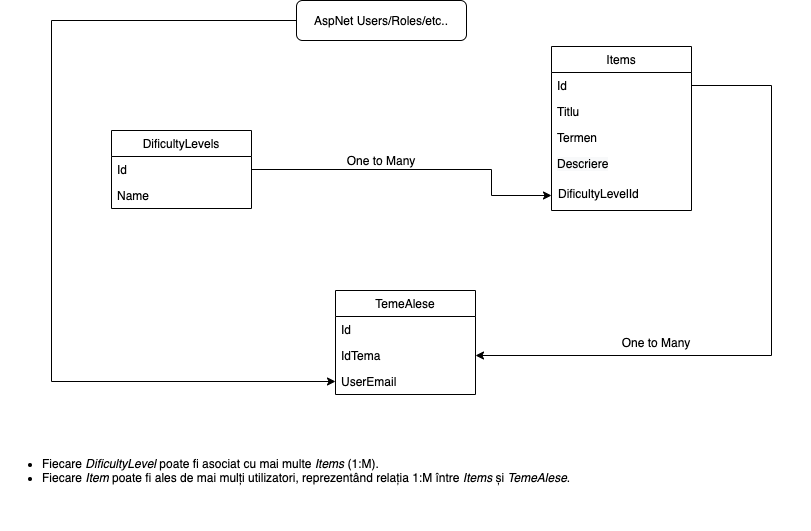

Aplicație web pentru gestionarea alegerii temelor de proiect de către studenți.
# MyApp

Acesta este un proiect de tip **ASP.NET Core MVC** care implementează modelul Model-View-Controller (MVC). Iată o descriere detaliată a structurii fișierelor și a bazei de date.

## 1. Structura Fișierelor

### **Controllers** (Controlere)
Controlerele sunt responsabile pentru logica aplicației și gestionarea cererilor HTTP. Ele acționează ca intermediari între Model și View, preluând datele de la model și transmițându-le către view-uri pentru a fi afișate utilizatorului.

Exemple:
- `AccountController.cs`: gestionează autentificarea și înregistrarea utilizatorilor.
- `HomeController.cs`: gestionează pagina principală a aplicației.
- `TemeController.cs`: gestionează funcționalitățile legate de teme.

### **Models** (Modele)
Modelele reprezintă datele și logica de acces la acestea. De obicei, ele sunt mapate pe baza de date și definesc structura obiectelor pe care aplicația le manipulează.

Exemple:
- `Users.cs`
- `DificultyLevel.cs`
- `Items.cs`
- `TemaAleasa.cs`

### **ViewModels** (Modele pentru Vedere)
ViewModel-urile sunt obiecte care combină mai multe modele și date necesare pentru a fi afișate într-un view. Ele sunt utile pentru a evita expunerea directă a modelelor către view-uri și pentru a optimiza datele transmise.

Exemple:
- `RegisterViewModel.cs`
- `LoginViewModel.cs`
- `TemeViewModel.cs`
- `VerifyEmailViewModel.cs`
- `ChangePasswordViewModel.cs`

### **Views** (Vederi)
View-urile sunt responsabile pentru afișarea interfeței utilizatorului. Acestea folosesc Razor (.cshtml) pentru a combina HTML cu datele primite de la controler.

Structura folderului **Views**:
- `Account`: conține pagini legate de autentificare (ex. `Login.cshtml`, `Register.cshtml`).
- `Home`: conține pagini generale, precum `Index.cshtml`.
- `Shared`: conține elemente reutilizabile, precum `_Layout.cshtml` (layout-ul principal) și `_ValidationScriptsPartial.cshtml` (pentru validarea formularelor).
- `Teme`: conține pagini pentru gestionarea temelor (ex. `Index.cshtml`, `AlegereTema.cshtml`, `Create.cshtml`).

---

## 2. Conexiuni între Componente

- **Controlerul** primește cereri HTTP, procesează datele din Model și trimite un ViewModel către View.
- **Modelul** interacționează cu baza de date, de obicei printr-un ORM precum Entity Framework Core.
- **View-urile** afișează datele primite de la controler folosind sintaxa Razor.

---

## 3. Exemplu de Flux de Lucru

1. Utilizatorul accesează `/Teme/Edit/1`.
2. `TemeController` primește cererea, preia datele temei cu ID = 1 din Model și le pune într-un ViewModel.
3. View-ul `Edit.cshtml` afișează datele temei utilizând Razor.

---

## 4. Structura Bazei de Date

### Tabelele Bazei de Date:

- **`AspNetUsers`**: Informații despre utilizatori.
- **`AspNetRoles`**: Definițiile rolurilor utilizatorilor (ex. Admin, User).
- **`AspNetUserRoles`**: Legătura între utilizatori și roluri.
- **`Items`**: Temele disponibile pentru alegere.
- **`DificultyLevels`**: Nivelurile de dificultate ale temelor.
- **`TemeAlese`**: Temele alese de utilizatori.

---
## Diagrama Bazei de Date:

## 5. Note

Acest proiect folosește Entity Framework Core pentru gestionarea bazei de date și are funcționalități de autentificare și gestionare a temelor. Funcțiile de autentificare includ înregistrarea, logarea și gestionarea parolelor, iar funcțiile de teme permit utilizatorilor să aleagă și să gestioneze teme.

